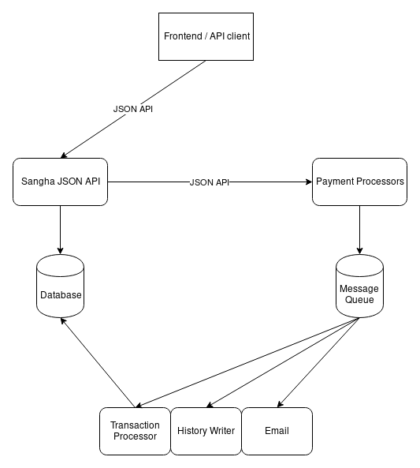

### Build instructions

```
export GOPATH=~/go
mkdir -p $GOPATH/src/gitlab.techcultivation.org/sangha
cd $GOPATH/src/gitlab.techcultivation.org/sangha

git clone git@gitlab.techcultivation.org:sangha/sangha.git
cd sangha
go get -u
go build
```

### Configure

```
cp config.example.json config.json
vim config.json
```

### Run sangha

```
./sangha
```

### Reference



Visit the API docs: http://localhost:9991/apidocs/
